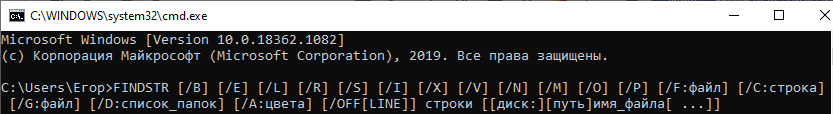
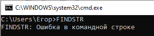

# УТИЛИТА FINDSTR ПРОГРАММНОЙ СТРОКИ CMD
## Техническое задание
# СОДЕРЖАНИЕ
1.	[ВВЕДЕНИЕ](#ВВЕДЕНИЕ)  
1.1.	[Наименование](#Наименование)  
1.2.	[Краткая характеристика области применения](#Краткая)  
2.	[ОСНОВАНИЯ ДЛЯ РАЗРАБОТКИ](#ОСНОВАНИЯ)  
2.1.	[Основания для проведения разработки](#Основания)  
2.2.	[Наименование и условное обозначение темы разработки](#Наименование_и)  
3.	[НАЗНАЧЕНИЕ РАЗРАБОТКИ](#НАЗНАЧЕНИЕ)  
3.1.	[Функциональное назначение](#Функциональное)  
3.2.	[Эксплуатационное назначение](#Эксплуатационное)  
4.	[ТРЕБОВАНИЯ К ПРОГРАММЕ](#ТРЕБОВАНИЯ)  
4.1.	[Требования к функциональным характеристикам](#Требования_к_фун)  
4.1.1.	[Требования к составу выполняемых функций](#Требования_к_сост)  
4.1.2.	[Требования к организации входных и выходных данных](#Требования_к_орг)  
4.1.3.	[Требования к временным характеристикам](#Требования_к_врем)  
4.2.	[Требования к надежности](#Требования_к_над)  
4.2.1.	[Требования к обеспечению устойчивого функционирования](#Требования_к_обес)  
4.2.2.	[Контроль входной и выходной информации](#Контроль)  
4.2.3.	[Время восстановления после отказа](#Время)  
4.3.	[Условия эксплуатации](#Условия)  
4.3.1.	[Климатические условия эксплуатации](#Климатические)  
4.3.2.	[Требования к видам обслуживания](#Требования_к_видам)  
4.3.3.	[Требования к численности и квалификации персонала](#Требования_к_чис)  
4.4.	[Требования к составу и параметрам технических средств](#Требования_к_сост_и)  
4.5.	[Требования к информационной и программной совместимости](#Требования_к_инфор)  
4.5.1.	[Требования к информационным структурам и методам решения](#Требования_к_инфо)  
4.5.2.	[Требования к исходным кодам и языкам программирования](#Требования_к_исх)  
4.5.3.	[Требования к программным средствам, используемых программой](#Требования_к_прог)  
4.5.4.	[Требования к защите информации и программ](#Требования_к_защ)  
4.6.	[Требования к маркировке и упаковке](#Требования_к_марк)  
4.7.	[Требования к транспортированию и хранению](#Требования_к_транс)  
4.8.	[Специальные требования](#Специальные)  
5.	[ТРЕБОВАНИЯ К ПРОГРАММНОЙ ДОКУМЕНТАЦИИ](#ТРЕБОВАНИЯ_К)  
5.1.	[Предварительный состав программной документации](#Предварительный)  
5.2.	[Специальные требования к программной документации](#Специальные_т)  
6.	[ТЕХНИКО-ЭКОНОМИЧЕСКИЕ ПОКАЗАТЕЛИ](#ТЕХНИКО)  
6.1.	[Ориентировочная экономическая эффективность](#Ориентировочная)  
6.2.	[Предполагаемая годовая потребность](#Предполагаемая)  
6.3.	[Экономические преимущества разработки](#Экономические)  
7.	[СТАДИИ И ЭТАПЫ РАЗРАБОТКИ](#СТАДИИ)  
7.1.	[Стадии разработки](#Стадии_)  
7.2.	[Этапы разработки](#Этапы)  
7.3.	[Содержание работ по этапам](#Содержание)  
8.	[ПОРЯДОК КОНТРОЛЯ И ПРИЕМКИ](#ПОРЯДОК)  
8.1.	[Виды испытаний](#Виды)  
8.2.	[Общие требования к приемке работы](#Общие)  

 
#  <a name="ВВЕДЕНИЕ">1.  ВВЕДЕНИЕ</a>
---

## <a name="Наименование">1.1  Наименование</a>
---

Наименование – «Утилита FINDSTR командной строки CMD»  

## <a name="Краткая">1.2.  Краткая характеристика области применения</a>
---

Утилита FINDSTR используется для поиска текстовой строки в одном или нескольких файлах с использованием регулярных выражений.   Регулярные выражения ( regular expressions ) – это своеобразный язык с применением обычных и специальных символов, задающих шаблон и   алгоритм поиска. Обычные символы ( литералы ) – это привычные текстовые знаки - буквы, цифры, знаки препинания и т. п. Специальные   символы ( метасимволы ) - это элементы записи правил и параметров обработки для обычных символов.  

 
# <a name="ОСНОВАНИЯ">2.  ОСНОВАНИЯ ДЛЯ РАЗРАБОТКИ</a>
---

## <a name="Основная">2.1.	Основания для проведения разработки</a>
---

Основания для проведения разработки является лабораторная работа №1 по дисциплине ТРПО. Лабораторная работа утверждена Сувальским А. А.  , в дальнейшем именуемым Заказчиком. Дата утверждения – 11.09.20.  

## <a name="Наименование">2.2.	Наименование и условное обозначение темы разработки</a>
---

Наименование темы разработки – «Разработка утилиты FINDSTR»  
Условное обозначение темы разработки – «А.В.00001»  

 
# <a name="НАЗНАЧЕНИЕ">3.	НАЗНАЧЕНИЕ РАЗРАБОТКИ</a>
---

## <a name="Функциональное">3.1.	Функциональное назначение</a>
---

Функциональным назначением утилиты является поиск текстовой строки в одном или нескольких файлах с использованием регулярных выражений.   Регулярные выражения ( regular expressions ) - это своеобразный язык с применением обычных и   специальных символов, задающих шаблон и алгоритм поиска. Обычные символы ( литералы ) - это привычные текстовые знаки - буквы, цифры, знаки препинания и т. п.   Специальные символы ( метасимволы ) - это элементы записи правил и параметров обработки для обычных символов.  

## <a name="Эксплуатационное">3.2.	Эксплуатационное назначение</a>
---

Утилита FINDSTR должна эксплуатироваться в интерпретаторе командной строки CMD или в пакетном файле.  

 
# <a name="ТРЕБОВАНИЯ">4.	ТРЕБОВАНИЯ К ПРОГРАММЕ</a>
---

## <a name="Требования_к_фун">4.1.	Требования к функциональным характеристикам</a>
---

### <a name="Требования_к_сост">4.1.1.	Требования к составу выполняемых функций</a>
--- 

Утилита FINDSTR должна обеспечивать возможность выполнения следующих функций:  
1)	функция выполнения команд для одного или нескольких файлов;  
2)	функция выполнения команд с использованием регулярных выражений;  
3)	функция выполнения команды поиска определенной строки в файлах с указанным расширением.  

### <a name="Требования_к_орг">4.1.2.	Требования к организации входных и выходных данных  </a> 
---

4.1.2.1.	Утилита FINDSTR должна иметь синтаксис, изображенный на рисунке ниже. 

 

Рассмотрим общий синтаксис команды FINDSTR:  
+ */B* – искать образец только в началах строк;  
+ */E* – искать образец только в конце строк;  
+ */L* – поиск строк дословно;  
+ */R* –поиск строк как регулярных выражений;  
+ */S* – поиск файлов в текущей папке и всех ее подпапках;  
+ */I* – определяет, что поиск будет вестись без учета регистра;  
+ */X* – печатает строки, которые совпадают точно;  
+ */V* – печатает строки, не содержащие совпадений с искомыми;  
+ */N* – печатает номер строки, в которой найдено совпадение, и ее содержимое;  
+ */M* – печатает только имя файла, в которой найдено совпадение;  
+ */O* – печатает найденный строки через пустую строку;  
+ */P* – пропускает строки, содержащие непечатаемые символы;  
+ */OFF[LINE]* – не пропускает файлы с установленным атрибутом "Автономный";  
+ */A:цвета* – две шестнадцатеричные цифры - атрибуты цвета.  
+ */F:файл* – читает список файлов из заданного файла (/ для консоли);  
+ */C:строка* – использует заданную строку как искомую фразу поиска;  
+ */G:файл* – получение строк из заданного файла (/ для консоли);  
+ */D:список_папок* – поиск в списке папок (разделяются точкой с запятой);  
+ *Строка* – искомый текст;  
+ *[диск:][путь]имя_файла* – задает имя файла или файлов.  

4.1.2.2.	Краткая сводка по синтаксису регулярных выражений, изображена на рисунке ниже.

 
Кроме параметров командной строки, справка дополнена краткой сводкой по синтаксису регулярных выражений:  
+ . - любой символ;  
+ \* - повтор: ноль или более вхождений предыдущего символа или класса;  
+ ^ - позиция в строке: начало строки;  
+ $ - позиция в строке: конец строки;  
+ [класс] - класс символов: любой единичный символ из множества;  
+ [^класс] - обратный класс символов: любой единичный символ из дополнения;  
+ [x-y] - диапазон: любые символы из указанного диапазона;  
+ \x - служебный символ: символьное обозначение служебного символа x;  
+ \< xyz - позиция в слове: в начале слова;  
+ xyz\ > - позиция в слове: в конце слова.  

4.1.2.3.	Особенности утилиты FINDSTR

+ Все параметры командной строки FINDSTR должны предшествовать строкам и именам файлов в строке команды;  
+ Для поиска шаблонов текста в регулярных выражениях используются как литеральные символы, так и мета-символы, а не точные строки   символов:  
- Литеральный символ — это символ, который не имеет особого значения в синтаксисе регулярных выражений; Вместо этого он соответствует вхождению этого символа. Например, буквы и цифры являются литеральными символами;  
- Мета-символ — это символ с особым значением (оператор или разделитель) в синтаксисе регулярных выражений.  
+ Для поиска нескольких строк в наборе файлов необходимо создать текстовый файл, содержащий каждый критерий поиска в отдельной строке.  
+ Используйте пробелы для разделения нескольких строк поиска, если только аргумент не имеет префикса с параметром /s.  

### <a name="Требования_к_вреь">4.1.3.	Требования к временным характеристикам </a>
---

Требования к временным характеристикам программы не предъявляются.

## <a name="Требования_к_над">4.2.	Требования к надежности</a>
--- 

### <a name="Требования_к_обес">4.2.1.	Требования к обеспечению устойчивого функционирования</a>
---

Надежность (устойчивое) функционирование программы должно быть обеспечено выполнением совокупности организационно-технических   мероприятий:  
1)	организацией бесперебойного питания технических средств;  
2)	выполнением рекомендаций Министерства труда и социального развития РФ, изложенных в Постановлении от 23 июля 1998 г. «Об   утверждении межотраслевых типовых норм времени на работы по сервисному обслуживанию ПЭВМ и оргтехники и сопровождению программных   средств»;  
3)	выполнение требований ГОСТ 51188-98. Защита информации. Испытания программных средств на наличие компьютерных вирусов;  
4)	необходимым уровнем квалификации сотрудников профильных подразделений.  

### <a name="Контроль">4.2.2.	Контроль входной и выходной информации</a>
---

В случае неправильного ввода команды FINDSTR, командная строка должна вывести сообщение, показанное на рисунке ниже.

 

### <a name="Время">4.2.3.	Время восстановления после отказа</a>
---

Время восстановления после отказа должно не превышать 30 минут.

## <a name="Условия">4.3.	Условия эксплуатации</a>
---

### <a name="Климатические">4.3.1.	Климатические условия эксплуатации</a>
---

Программа должна работать в закрытых помещениях, при нормальных климатических условиях.  
Температура окружающего воздуха должна быть в диапазоне 20-25 градусов, относительная влажность на уровне 40-60%.  

### <a name="Требования_к_видам">4.3.2.	Требования к видам обслуживания</a>
---

Проводится периодическое тестирование программы, раз в полгода.

### <a name="Требования_к_чис">4.3.3.	Требования к численности и квалификации персонала</a>
---

Минимальное количество персонала, требуемого для работы программы, должно составлять не менее двух штатных единиц – системный   программист и конечный пользователь программы – оператор.  
Системный программист должен иметь минимум среднее техническое образование. В перечень задач, выполняемых системным программистом, должны входить:  
1)	задача поддержания работоспособности технических средств;  
2)	задача установки (инсталляции) и поддержания работоспособности системного программного средства – операционной системой;  
3)	задача установки (инсталляции) программы.  
Конечный пользователь программы (оператор) должен обладать практическими навыками работы с графическим пользовательским интерфейсом  оперативной системы.  

## <a name="Требования_к_сост">4.4.	Требования к составу и параметрам технических средств</a>
---

В состав технических средств должен входить IBM-совместимый персональный компьютер (ПЭВМ), включающий в себя: 
1)	процессор Pentium – 4 с тактовой частотой не менее 300 МГц;  
2)	оперативная память объемом не менее 128 Мб;  
3)	жесткий диск объемом 1.5 Гб и выше.  

## <a name="Требования_к_инфор">4.5.	Требования к информационной и программной совместимости</a>
---

### <a name="Требования_к_инфо">4.5.1.	Требования к информационным структурам и методам решения</a>
---

Требования к информационным структурам на входе и выходе, а также к методам решения не предъявляются.  

### <a name="Требования_к_исх">4.5.2.	Требования к исходным кодам и языкам программирования</a>
---

Исходные коды программы должны быть реализованы в пакетном файле или непосредственно в интерпретаторе командной строки CMD.  

### <a name="Требования_к_прог">4.5.3.	Требования к программным средствам, используемых программой</a>
---

Должна использоваться командная строка, встроенная в операционную систему Windows XP.  

### <a name="Требования_к_защ">4.5.4.	Требования к защите информации и программы</a>
---

Требования к защите информации и программ не предъявляются.  

## <a name="Требования_к_марк">4.6.	Требования к маркировке и упаковке</a>
---

Требования к маркировке и упаковке не предъявляются.  

## <a name="Требования_к_транс">4.7.	Требования к транспортированию и хранению</a>
---

Требования к транспортированию и хранению не предъявляются.  

## <a name="Специальные">4.8.	Специальные требования</a>
---

Специальные требования к программе не предъявляются.

 
# <a name="ТРЕБОВАНИЯ">5.	ТРЕБОВАНИЯ К ПРОГРАММНОЙ ДОКУМЕНТАЦИИ</a>
---

## <a name="Предварительный">5.1.	Предварительный состав программной документации</a>
---

Состав программной документации должен включать в себя:  
1)	техническое задание;  
2)	спецификация;  
3)	текст программы;  
4)	описание программы;  
5)	программу и методики испытаний;  
6)	пояснительную записку;  
7)	ведомость эксплуатационных документов;  
8)	формуляр;  
9)	описание применения;  
10)	руководство системного программиста;  
11)	руководство программиста;  
12)	руководство оператора.  

## <a name="Специальные_т">5.2.	Специальные требования к программной</a>
---

Специальные требования к программной документации не предъявляются.  

 
# <a name="ТЕХНИКО">6.	ТЕХНИКО-ЭКОНОМИЧЕСКИЕ ПОКАЗАТЕЛИ</a>
---

## <a name="Ориентировочная">6.1.	Ориентировочная экономическая эффективность</a>
---

Ориентировочная экономическая эффективность не рассчитывается.  

## <a name="Предполагаемая">6.2.	Предполагаемая годовая потребность</a>
---

Предполагаемая годовая потребность не рассчитывается.  

## <a name="Экономические">6.3.	Экономические преимущества разработки</a>
---

Экономические преимущества разработки не рассчитываются.

 
# <a name="СТАДИИ">7.	СТАДИИ И ЭТАПЫ РАЗРАБОТКИ</a>
---

## <a name="Стадии_">7.1.	Стадии разработки</a>
---

Разработка должна быть проведена в три стадии:  
1)	разработка технического задания;  
2)	рабочее проектирование;  
3)	внедрение.  

## <a name="Этапы">7.2.	Этапы разработки</a>
---

На стадии разработки технического задания должен быть выполнен этап разработки, согласования и утверждения между Заказчиком и   Исполнителем настоящего технического задания.  
На стадии рабочего проектирования должны быть выполнены следующие этапы работы:  
1)	разработка программы;  
2)	разработка программной документации;  
3)	испытания программы.  
На стадии внедрения должен быть выполнен этап разработка – подготовка и передача программы.  

## <a name="Содержание">7.3.	Содержание работ по этапам</a>
---

На этапе разработки технического задания должны быть выполнены следующие виды работ:  
1)	постановка задачи;  
2)	определение и уточнение требований к техническим средствам;  
3)	определение требований к программе;  
4)	определение стадий, этапов и сроков разработки программы и документации на нее;  
5)	выбор языков программирования;  
6)	согласование и утверждение технического задания.  
На этапе разработки программной документации должна быть выполнена разработка программных документов в соответствии с требованиями ГОСТ   19.101-77 и требованием п. «Предварительный состав программный документации» настоящего технического задания.  

На этапе испытаний программы должны быть выполнены следующие виды работ:  
1)	разработка, согласование и утверждение программы и методики испытаний;  
2)	ведение приемо-сдаточных испытаний;  
3)	корректировка программы и программной документации по результатам испытаний.  
На этапе подготовки и передачи программы должна быть выполнена работа по подготовке и передаче программы и программной документации в   эксплуатацию на объектах Заказчика.  

 
# <a name="ПОРЯДОК">8.	ПОРЯДОК КОНТРОЛЯ И ПРИЕМКЕ</a>
---

## <a name="Виды">8.1.	Виды испытаний </a>
---

Приемо-сдаточные испытания программы должны проводиться согласно разработанной Исполнителем и согласованной Заказчиком «Программы и   методики испытаний».  
Ход проведения приемо-сдаточных испытаний Заказчик и Исполнитель документируют в Протоколе проведения испытаний.  

## <a name="Общие">8.2.	Общие требования к приемке работы</a>
---

После проведения испытаний в полном объеме, на основании «Протокола испытаний» утверждают «Свидетельство о приемке» и производят запись   в программном документе «Формуляр».  
